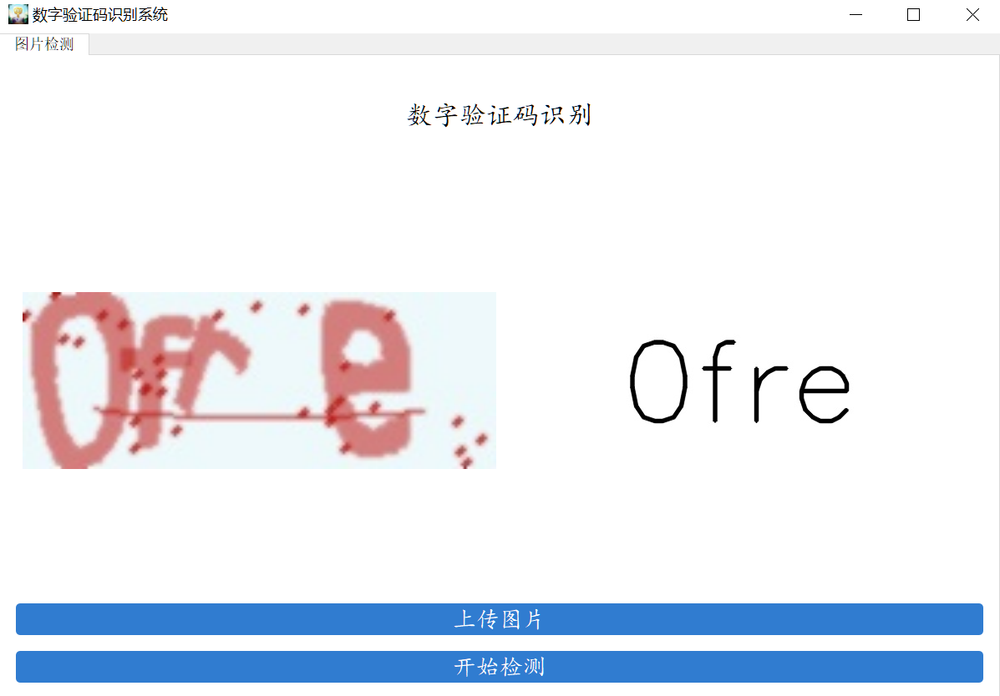

# 数字验证码识别系统

基于 PyTorch + PyQt5 的 4 位字母数字验证码识别系统，支持模型训练、批量预测和桌面 GUI 识别。



## 项目结构

```
captcha_reg2/
├── common.py              # 公共配置（字符集、路径常量）
├── model.py               # 神经网络模型定义（4种网络）
├── one_hot.py             # One-Hot 编码/解码模块
├── my_datasets.py         # 自定义 PyTorch Dataset
├── generate_dataset.py    # 验证码数据集生成脚本
├── train.py               # 训练脚本（基础版）
├── train2.py              # 训练脚本（改进版，支持预训练 + 准确率评估）
├── predict.py             # 预测模块（批量测试 / 单张预测）
├── window.py              # PyQt5 桌面 GUI 应用
├── requirements.txt       # Python 依赖
├── .gitignore             # Git 忽略规则
├── datasets/              # 数据集目录
│   ├── train/             # 训练集
│   └── test/              # 测试集（5000张）
├── weights/               # 训练权重保存目录
├── weights2/              # 预训练权重目录
├── images/                # 图片资源
│   ├── UI/                # 界面素材
│   └── tmp/               # 临时文件
├── logs/                  # TensorBoard 日志
└── output/                # PyInstaller 打包输出
    └── window/
        ├── window.exe     # 可执行文件
        ├── images/        # 打包的图片资源
        ├── weights/       # 打包的模型权重
        └── _internal/     # 依赖库
```

## 环境要求

- Python 3.9+
- CUDA（可选，有 GPU 自动启用加速）

## 安装

```bash
pip install -r requirements.txt
```

依赖列表：

| 包名 | 用途 |
|------|------|
| torch >= 1.9.0 | 深度学习框架 |
| torchvision >= 0.10.0 | 图像预处理 |
| PyQt5 >= 5.15.0 | 桌面 GUI |
| opencv-python >= 4.5.0 | 图像处理 |
| Pillow >= 8.0.0 | 图片读取 |
| captcha >= 0.4 | 验证码生成 |
| tensorboard >= 2.5.0 | 训练可视化 |
| numpy >= 1.19.0 | 数值计算 |

## 模型架构

[model.py](model.py) 包含 4 种网络结构，输出维度均为 `[batch, 144]`（4 字符 × 36 类别）：

### 1. mymodel（原始网络）

基础 CNN，layer1~layer4 + layer6 分层定义，无 BatchNorm。

```
Conv(1→64) → ReLU → MaxPool
Conv(64→128) → ReLU → MaxPool
Conv(128→256) → ReLU → MaxPool
Conv(256→512) → ReLU → MaxPool
Flatten → Linear(15360→4096) → Dropout(0.2) → ReLU → Linear(4096→144)
```

### 2. CaptchaModel（优化版）

网络结构与 mymodel 完全一致，代码组织更规范：合并为 `features` + `classifier` 两个 Sequential，权重可与 mymodel 互相加载。

### 3. CRNN（CNN + BiLSTM）

参考 meijieru/crnn.pytorch 设计，BiLSTM 能捕捉字符间的序列依赖关系。

```
CNN 特征提取（5层 Conv + BN + MaxPool）
→ 自适应池化压缩高度为1，宽度固定为4
→ BiLSTM 序列建模（2层双向）
→ 全连接解码器（每个时间步独立分类）
```

### 4. CaptchaNet（SE-ResNet 风格，推荐）

在 CaptchaModel 基础上增加 BatchNorm、SE 注意力、残差连接和 Kaiming 初始化。

```
ResBlock(1→64) + SE + MaxPool
ResBlock(64→128) + SE + MaxPool
ResBlock(128→256) + SE + MaxPool
ResBlock(256→512) + SE + MaxPool
AdaptiveAvgPool(1,1) → Linear(512→1024) → BN → ReLU → Dropout(0.3) → Linear(1024→144)
```

### 网络对比

| 特性 | mymodel | CaptchaModel | CRNN | CaptchaNet |
|------|---------|-------------|------|-----------|
| BatchNorm | ✗ | ✗ | ✓ | ✓ |
| 残差连接 | ✗ | ✗ | ✗ | ✓ |
| 注意力机制 | ✗ | ✗ | ✗ | ✓ (SE) |
| 序列建模 | ✗ | ✗ | BiLSTM | ✗ |
| 自适应池化 | ✗ | ✗ | ✓ | ✓ |
| 权重初始化 | 默认 | 默认 | 默认 | Kaiming |

## 使用方法

### 1. 生成数据集

```bash
python generate_dataset.py --output ./datasets/train --num 5000
python generate_dataset.py --output ./datasets/test --num 5000
```

### 2. 训练模型

**基础训练**（从零开始，仅训练，不评估准确率）：

```python
# train.py
from model import CaptchaModel
trainer = Trainer(CaptchaModel)
trainer.train()
```

```bash
python train.py
```

**改进训练**（支持预训练权重加载 + 最后一轮自动评估准确率）：

```python
# train2.py
from model import CaptchaNet
trainer = Trainer2(CaptchaNet)
trainer.train()
```

```bash
python train2.py
```

`Trainer2` 构造参数：

| 参数 | 默认值 | 说明 |
|------|--------|------|
| model_class | CaptchaModel | 网络类 |
| epoch_num | 5 | 训练轮数 |
| batch_size | 64 | 批次大小 |
| learning_rate | 0.001 | 学习率 |
| save_interval | 5 | 每隔多少轮保存权重 |
| pretrained_weight | common.PRETRAINED_WEIGHT | 预训练权重路径 |
| use_onehot | True | True 用 one_hot 解码比较，False 用 argmax 直接比较 |

### 3. 预测

```python
# predict.py
from model import CaptchaModel
predictor = Predictor(CaptchaModel)

# 批量测试准确率
predictor.test_pred()

# 单张图片预测
predictor.pred_pic("./datasets/test/0kwf_1736583132.png")
```

```bash
python predict.py
```

### 4. GUI 应用

```bash
python window.py
```

启动桌面应用，支持上传图片 → 点击检测 → 显示识别结果。

可通过修改 `window.py` 底部切换网络：

```python
# 切换为 CaptchaNet
window = MainWindow(model_class=CaptchaNet)

# 切换为原始网络加载旧权重
window = MainWindow(model_class=mymodel, weight_path="./weights/ocr_30.pth")
```

### 5. TensorBoard 查看训练过程

```bash
tensorboard --logdir=logs
```

## 配置说明

所有路径配置集中在 [common.py](common.py)：

| 常量 | 值 | 说明 |
|------|----|------|
| captcha_array | "0123456789abcdefghijklmnopqrstuvwxyz" | 36 个字符 |
| captcha_size | 4 | 验证码字符数 |
| WEIGHT_DIR | "./weights" | 训练权重保存目录 |
| PRETRAINED_WEIGHT | "./weights2/ocr_15.pth" | 预训练权重路径 |
| TEST_DATASET_DIR | "./datasets/test" | 测试集路径 |
| TRAIN_DATASET_DIR | "./datasets/train" | 训练集路径 |

## 打包部署

项目已使用 PyInstaller 打包为独立可执行文件：

```
output/window/window.exe
```

打包时需将 `images/` 和 `weights/` 目录复制到 `output/window/` 下。
